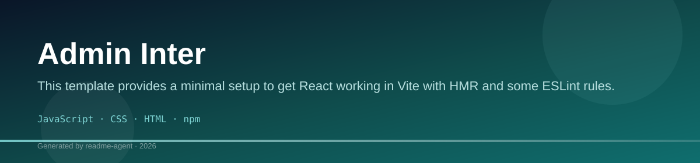
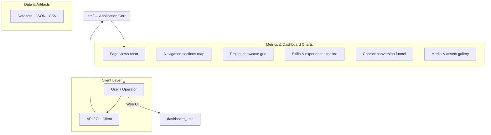
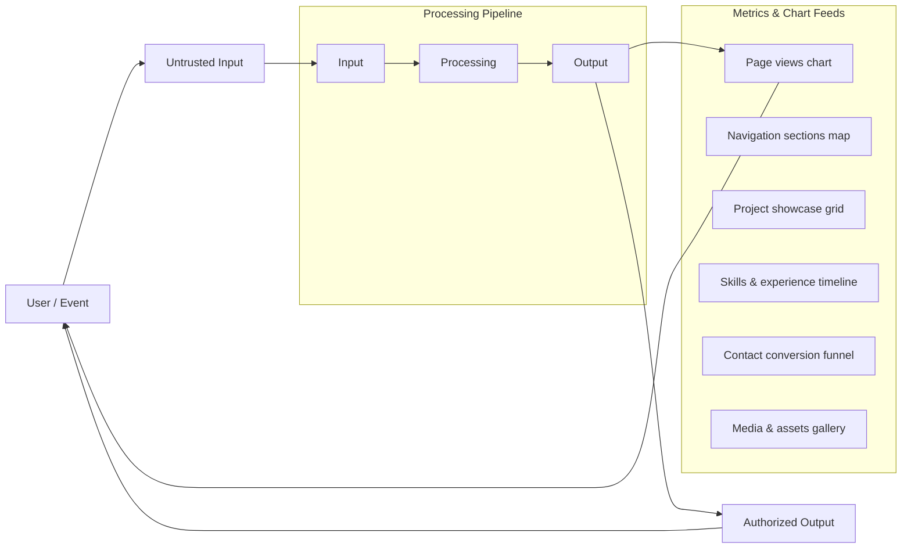
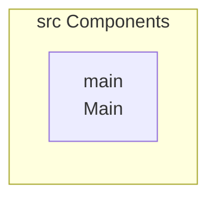
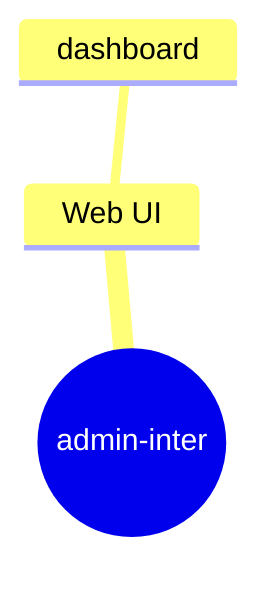
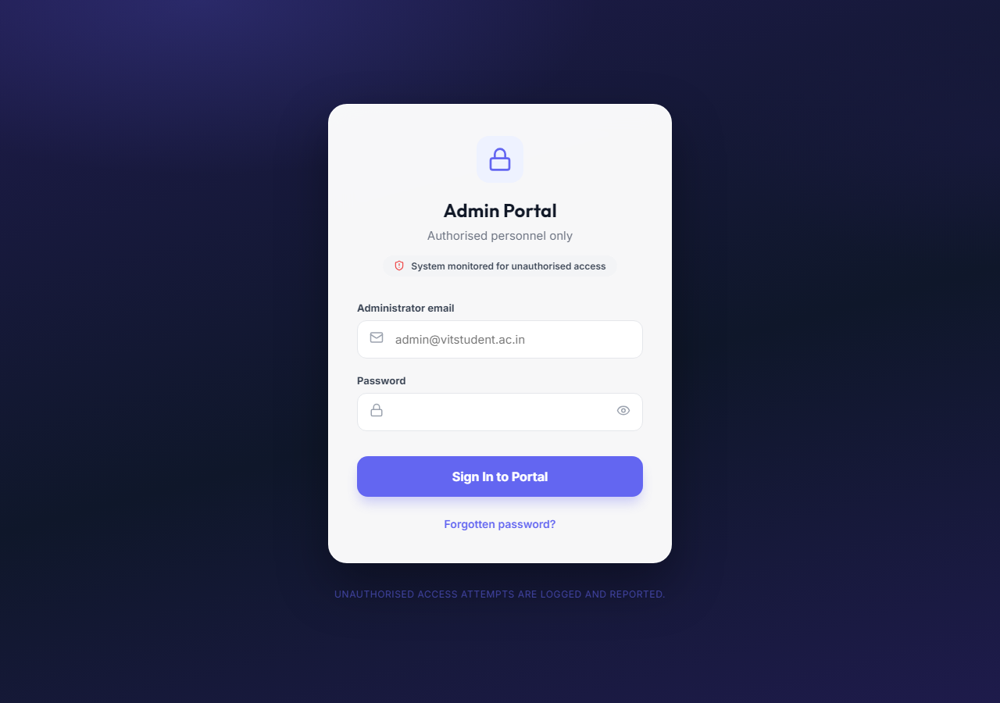
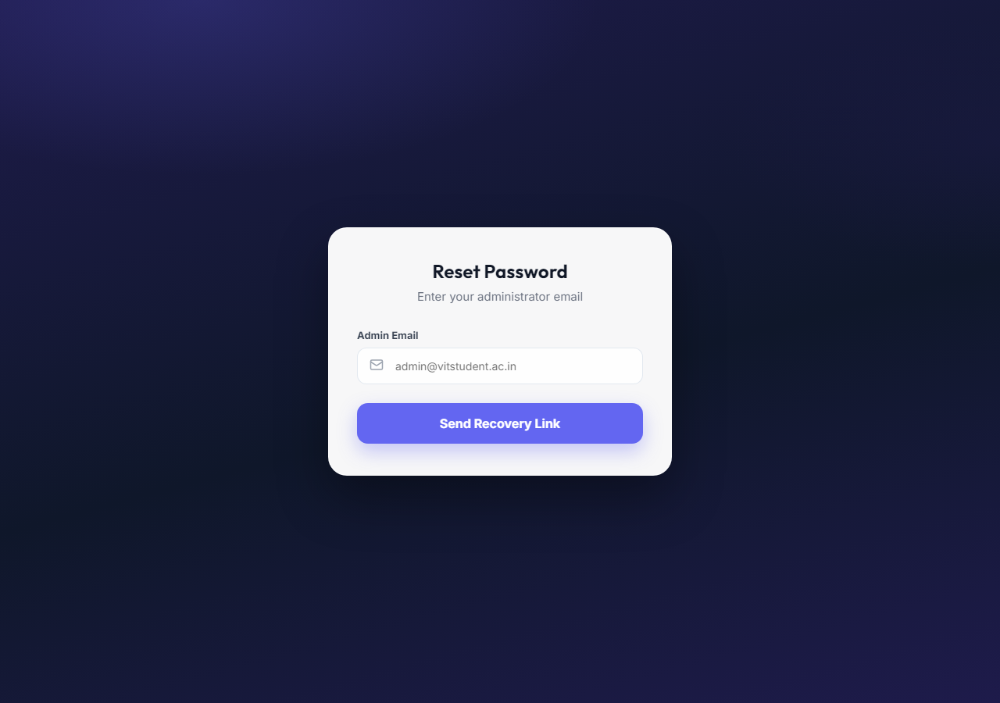
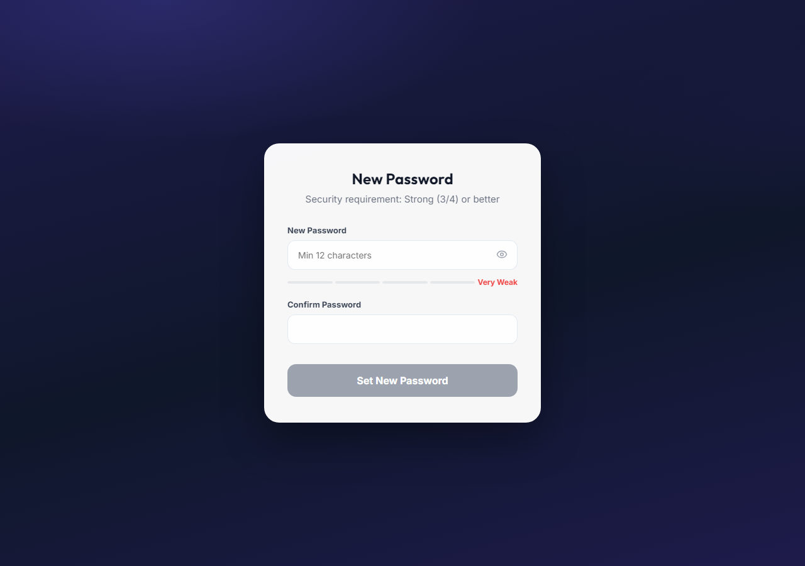

# Admin Inter

This template provides a minimal setup to get React working in Vite with HMR and some ESLint rules.

## Technology Stack

- JavaScript
- CSS
- HTML
- npm

# Admin Inter

This template provides a minimal setup to get React working in Vite with HMR and some ESLint rules.

Admin Inter is a template designed for building administrative interfaces, featuring robust authentication flows and real-time order monitoring capabilities.

## 🚀 Features

This application is structured to handle complex administrative tasks, including:

*   **Authentication:** Dedicated components for user login, forgot password, and protected routes (`src/auth/Login.jsx`, `src/auth/ProtectedRoute.jsx`).
*   **State Management:** Custom hooks for handling authentication state (`src/hooks/useAdminAuth.js`) and session timeouts.
*   **Order Monitoring:** Components for displaying live order data (`src/components/LiveOrderCard.jsx`) and monitoring campus orders (`src/hooks/useCampusOrderMonitor.js`).
*   **Database Integration:** Includes Supabase migration files for real-time public shop data (`supabase/migrations/20260404120000_realtime_public_shops.sql`).

## 🛠️ Tech Stack

*   JavaScript
*   CSS
*   HTML
*   npm

## ⚙️ Installation

To get started, follow these steps:

1.  **Clone the repository:**
    ```bash
git clone [repository-url]
cd admin-inter
```
2.  **Install dependencies:**
    ```bash
npm install
```

## ▶️ Usage

### Development

To run the application in development mode with Hot Module Replacement (HMR):
```bash
npm run dev
```

### Building for Production

To create a production build of the application:
```bash
npm run build
```

### Running Tests (Linting)

To run ESLint checks on the project:
```bash
npm run lint
```

### Previewing the Build

To serve the production build locally for testing:
```bash
npm run preview
```

## 📂 Project Structure

The project is organized into several key directories:

*   **`src/`**: Contains all application source code, including components, hooks, and authentication logic.
    *   `src/auth/`: Authentication related files (e.g., `Login.jsx`, `ForgotPassword.jsx`).
    *   `src/hooks/`: Custom hooks for business logic (e.g., `useAdminAuth.js`).
    *   `src/components/`: Reusable UI components (e.g., `LiveOrderCard.jsx`).
*   **`supabase/`**: Contains database migration scripts for Supabase integration.
*   **`public/`**: Static assets like favicons and icons.
*   **Root**: Configuration files (`package.json`, `vite.config.js`, `eslint.config.js`).

## Setup Guide

### Frontend Setup

```bash

npm install
npm run dev     # development
npm run build && npm start   # production
```

Open `http://127.0.0.1:5173` (or the port shown in the terminal).

### Configuration

Copy environment templates before running:

- `.env.example` → copy to `.env` in the same directory

### Running the Application

1. **Start web app** — `npm run dev` in `./`

```bash
cd .
npm install
npm run dev
```

## System Architecture

High-level system design, data flows, API map, and workflow pipelines derived from the repository structure.

### System Architecture



### Data Flow & Charts Pipeline



### Component & API Map



### Application Page Map



## Application Pages

Screenshots captured from the running application. Each page is listed with its function.

### Application

#### Analytics

Analytics — application page at `/analytics`



#### Forgot Password

Forgot Password — application page at `/forgot-password`



#### Reset Password

Reset Password — application page at `/reset-password`


