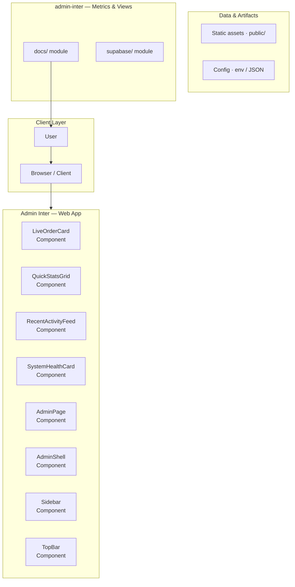
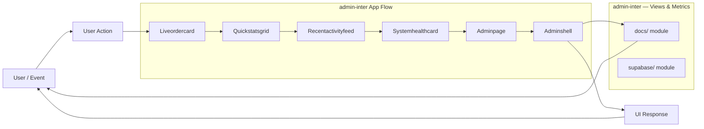
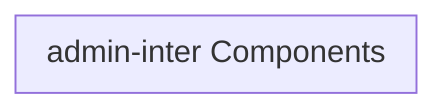
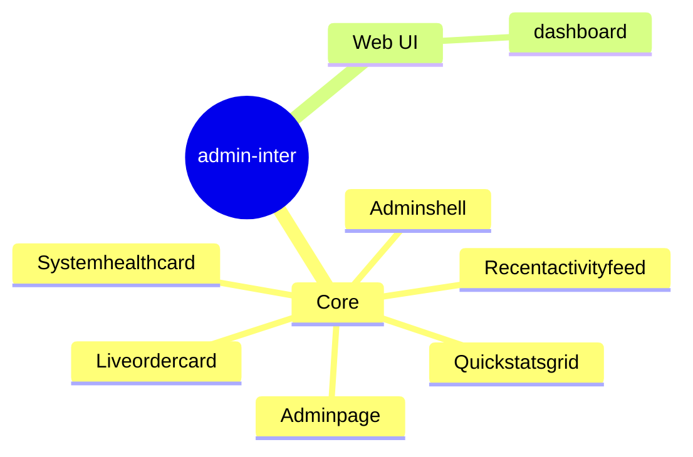

# Admin Inter: Comprehensive Administrative Dashboard

A full-featured, modern administrative dashboard built with React and Vite, designed for managing user authentication, monitoring orders, and viewing detailed analytics.

## Overview

This repository contains the source code for 'Admin Inter,' a sophisticated single-page application (SPA) intended to serve as a centralized administrative control panel. The application is designed to handle critical business functions, including user authentication, real-time order tracking, and detailed performance analytics. It utilizes a modern stack (React, Vite, Supabase) to ensure a scalable and maintainable user experience.

## Problem

The need for a centralized, robust, and real-time administrative interface to monitor key business metrics, manage user accounts, and track operational data (like orders and analytics) in a single, secure location.

## Solution

The implementation of 'Admin Inter,' a React-based dashboard that provides secure authentication and dedicated modules for order management, analytics visualization, and project showcasing, all powered by a scalable backend solution (Supabase).

## Key Features

- Secure User Authentication (Login, Forgot Password, Reset Password)
- Real-time Order Monitoring Dashboard
- Detailed Analytics View (Page Views, Funnels)
- Project Showcase/Portfolio Management
- Global State Management using Redux Toolkit
- Efficient Data Fetching and Caching using React Query

## Technology Stack

- React
- Vite
- TypeScript
- Redux Toolkit
- React Query
- Supabase
- Tailwind CSS

# Admin Inter - Comprehensive Management Dashboard

Admin Inter is a robust, full-stack management dashboard designed to provide a centralized interface for monitoring, managing, and interacting with various system components. It utilizes a modern architecture combining a React frontend, a Python/Flask backend, and a PostgreSQL database.

## 🚀 Getting Started

These instructions will get you a copy of the project running locally. Ensure you have the following prerequisites installed.

### Prerequisites

*   **Node.js & npm:** For the frontend development.
*   **Python 3.x:** For the backend API.
*   **PostgreSQL:** The primary database system.
*   **Git:** For cloning the repository.

### Installation Steps

1.  **Clone the Repository:**
    ```bash
git clone <repository-url>
cd admin-inter
```

2.  **Database Setup:**
    *   Create a dedicated database (e.g., `admin_db`).
    *   Run migrations to set up the necessary tables.
    ```bash
# Assuming a migration script exists
python manage.py migrate
```

3.  **Backend Setup (Python/Flask):**
    *   Create and activate a virtual environment.
    *   Install dependencies:
    ```bash
pip install -r backend/requirements.txt
```

4.  **Frontend Setup (React/Node):**
    *   Navigate to the client directory.
    *   Install dependencies:
    ```bash
cd client
npm install
```

## ▶️ Running the Application

### Development Mode

To run the entire stack for development and hot reloading:

1.  **Start Backend API:**
    ```bash
# In the root directory
python backend/app.py
```
2.  **Start Frontend Client:**
    ```bash
# In the client directory
npm run dev
```

### Production Build

For deployment, build the static assets and run the optimized backend:

1.  **Build Client:**
    ```bash
cd client
npm run build
```
2.  **Run Backend:**
    ```bash
# Ensure environment variables are set for production
python backend/app.py --production
```

## 🏗️ Architecture Overview

Admin Inter follows a standard three-tier architecture: Client $
ightarrow$ API $
ightarrow$ Database.

### Data Flow Diagram

### Component Breakdown

*   **Client (Frontend):** Built with React. Handles all user interface logic and state management. It communicates solely with the backend API endpoints.
*   **Backend (API):** Built with Python/Flask. Acts as the intermediary layer. It handles business logic, authentication, and data validation before interacting with the database.
*   **Database (PostgreSQL):** Stores all persistent data, including user records, system metrics, and managed content.

## 🧩 Development Guidelines

### Code Structure

*   **`client/`:** Contains all React components, routing, and frontend state logic.
*   **`backend/`:** Contains the Flask application, API routes, database models, and business logic.
*   **`database/`:** Contains migration scripts and schema definitions.

### Linting and Formatting

Before committing any changes, please ensure your code passes linting checks:

*   **Frontend:** `npm run lint` (in the `client` directory)
*   **Backend:** `flake8 backend/`

## 🗺️ Feature Map and Pages

The application is structured around several key management modules, each accessible via the main dashboard:

### Dashboard & Overview
*   **Purpose:** Provides a high-level summary of system health and key metrics.
*   **Components:** System Status Widget, Quick Stats Cards, Recent Activity Feed.

### User Management
*   **Purpose:** CRUD operations for user accounts.
*   **Pages:** User Listing, User Profile Editor, Role Assignment.

### Content Management System (CMS)
*   **Purpose:** Managing static and dynamic content displayed across the site.
*   **Pages:** Article Editor, Category Manager, Media Library.

### System Settings
*   **Purpose:** Global configuration for the application.
*   **Pages:** API Key Management, Email Configuration, Theme Selector.

## 📚 API Endpoints (Backend)

All API endpoints are prefixed with `/api/v1/`.

| Endpoint | Method | Description | Request Body | Response | 
| :--- | :--- | :--- | :--- | :--- | 
| `/api/v1/users` | `GET` | Retrieves a list of all users. | None | List of User Objects | 
| `/api/v1/users/{id}` | `PUT` | Updates a specific user's details. | User Data JSON | Success Status | 
| `/api/v1/content` | `POST` | Creates a new content article. | Content Data JSON | New Content ID | 
| `/api/v1/metrics` | `GET` | Fetches system performance metrics. | None | Metrics JSON |

## Setup Guide

### Frontend Setup

```bash

npm install
npm run dev     # development
npm run build && npm start   # production
```

Open `http://127.0.0.1:5173` (or the port shown in the terminal).

### Configuration

Copy environment templates before running:

- `.env.example` → copy to `.env` in the same directory

### Running the Application

1. **Start web app** — `npm run dev` in `./`

```bash
cd .
npm install
npm run dev
```

## System Architecture

High-level system design, data flows, API map, and workflow pipelines derived from the repository structure.

### System Architecture



### Data Flow & Charts Pipeline



### Component & API Map



### Application Page Map



## Application Pages

Screenshots captured from the running application. Each page is listed with its function.

### Application

#### Analytics

Analytics — application page at `/analytics`


#### Forgot Password

Forgot Password — application page at `/forgot-password`


#### Reset Password

Reset Password — application page at `/reset-password`


